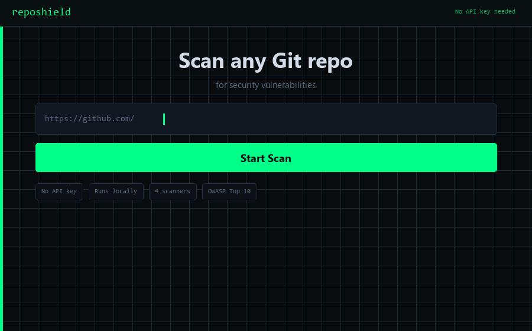

# RepoShield: AI-powered security vulnerability scanner

> Scan any Git repo for secrets, vulnerable dependencies, insecure code patterns, and buried git-history leaks. Optionally run it through GPT-4, Claude, or Gemini for a deeper read.

**Live demo:** [securitychecker.whhite.com](https://securitychecker.whhite.com) &nbsp;|&nbsp; **Install:** `npx reposhield`



---

## Features

- **Secrets detection:** regex + entropy-based scanning for hardcoded API keys, tokens, passwords, private keys, and connection strings across all file types
- **Dependency scanning:** checks `package.json`, `requirements.txt`, `Gemfile.lock`, `Cargo.toml`, and more against the [OSV vulnerability database](https://osv.dev)
- **Static analysis:** OWASP Top 10 pattern matching for SQL injection, XSS, command injection, path traversal, insecure deserialization, and more
- **Git history scanning:** walks every commit to surface secrets that were added and later removed (still present in git objects)
- **AI deep analysis:** sends selected source files to GPT-4, Claude, or Gemini for context-aware vulnerability analysis
- **Multi-provider AI:** bring your own key for OpenAI, Anthropic, or Google Gemini; enter it in the UI, no config files needed
- **Real-time progress:** WebSocket-powered live updates as each scanner runs
- **Severity levels:** findings ranked Critical, High, Medium, Low, and Info with confidence scores
- **Export:** download scan results as JSON for CI/CD pipelines or audit trails

---

## Quick start

### npx (zero install)

```bash
npx reposhield scan https://github.com/owner/repo
```

No install needed. Runs directly via npm. Optionally pass an AI key:

```bash
npx reposhield scan https://github.com/owner/repo --ai-key sk-...
```

---

### Docker (recommended)

Requires [Docker Desktop](https://www.docker.com/products/docker-desktop/) (includes Docker Compose).

```bash
git clone https://github.com/ibrahimokdadov/reposhield.git
cd reposhield

# Optional: add AI API keys (or enter them in the UI later)
cp .env.example .env
# edit .env with your preferred editor

docker-compose up
```

Open **http://localhost:3000** in your browser.

To rebuild after a code change:

```bash
docker-compose up --build
```

To stop:

```bash
docker-compose down
```

---

### Manual setup

#### Prerequisites

| Tool | Minimum version |
|------|----------------|
| Python | 3.9+ |
| Node.js | 18+ |
| Git | any recent version |

#### Backend

```bash
cd backend

# Create and activate a virtual environment
python -m venv .venv
source .venv/bin/activate        # Windows: .venv\Scripts\activate

# Install dependencies
pip install -r requirements.txt

# Start the API server (hot-reload enabled)
uvicorn main:app --host 0.0.0.0 --port 8000 --reload
```

The API will be at **http://localhost:8000**. Interactive docs at **http://localhost:8000/docs**.

#### Frontend

```bash
cd frontend
npm install
npm run dev
```

The UI will be at **http://localhost:5173** and will proxy `/api` and `/ws` to the backend.

#### One-command startup scripts

```bash
# Unix / macOS
chmod +x start.sh && ./start.sh

# Windows (Command Prompt)
start.bat
```

Both scripts check prerequisites, set up the virtual environment, install all dependencies, and start both services. Logs go to `.logs/`.

---

## How it works

RepoShield clones the target repository into an isolated temp directory, then runs five analysis passes:

### 1. Secrets scanner

Applies 80+ regex patterns covering AWS keys, GitHub tokens, Stripe keys, JWT secrets, SSH private keys, database URIs, and more. Shannon entropy analysis catches high-entropy strings that don't match a known pattern but look like secrets anyway.

### 2. Dependency scanner

Parses dependency manifests for all major package ecosystems and queries the [OSV.dev](https://osv.dev) API for known CVEs and security advisories. Returns per-package details including CVSS score, affected version range, and fix version.

Supported ecosystems:

| Ecosystem | Manifest files |
|-----------|---------------|
| npm / Node.js | `package.json`, `package-lock.json` |
| Python / PyPI | `requirements.txt`, `Pipfile`, `pyproject.toml` |
| Ruby / RubyGems | `Gemfile`, `Gemfile.lock` |
| Rust / crates.io | `Cargo.toml`, `Cargo.lock` |
| Go modules | `go.mod` |
| PHP / Composer | `composer.json`, `composer.lock` |

### 3. Static analysis

Pattern-based scanner (no AST required) that detects insecure coding constructs across multiple languages, mapped to OWASP Top 10 categories:

- **A01 Broken access control:** missing authorization checks, insecure direct object references
- **A02 Cryptographic failures:** use of MD5/SHA1, hardcoded IVs, weak ciphers
- **A03 Injection:** SQL injection, LDAP injection, OS command injection, eval/exec on user input
- **A04 Insecure design:** debug flags left on, stack traces exposed to users
- **A05 Security misconfiguration:** `CORS *`, debug mode, verbose error messages
- **A07 Auth failures:** HTTP basic auth, JWT `none` algorithm, missing token validation
- **A08 Software integrity failures:** `eval()`, `pickle.loads()`, `deserialize()`
- **A10 SSRF:** unvalidated URL fetching with user-supplied input

### 4. Git history scanner

Uses GitPython to walk every commit in the repository. For each diff, it re-runs the secrets patterns against the added lines. This catches credentials that were committed by mistake and later removed. They remain accessible in git objects and should be treated as permanently compromised.

### 5. AI deep analysis

After the automated scans, pick any source files and send them to an AI provider for a full code review. The AI gets the file content plus the automated findings for that file, so it can explain exploitability and suggest specific fixes rather than generic advice.

Supported models:

| Provider | Models |
|----------|--------|
| OpenAI | GPT-4o, GPT-4 Turbo, GPT-3.5 Turbo |
| Anthropic | Claude 3.5 Sonnet, Claude 3 Opus, Claude 3 Haiku |
| Google | Gemini 1.5 Pro, Gemini 1.5 Flash |

---

## AI provider support

Three ways to supply an API key (highest priority wins):

1. **UI:** enter the key in the scan panel; used for that session only, never written to disk.
2. **`.env` file:** copy `.env.example` to `.env` at the project root and fill in the relevant key(s).
3. **Environment variable:** set `OPENAI_API_KEY`, `ANTHROPIC_API_KEY`, or `GEMINI_API_KEY` before starting the server.

No AI key required. The local scanners run fine without one.

---

## Supported languages

The static and secrets scanners work on any text-based file. Language-aware pattern sets are included for:

Python, JavaScript/TypeScript, Java, Go, Ruby, PHP, C/C++, C#, Rust, Kotlin, Swift, Shell/Bash, Terraform, Kubernetes YAML, Dockerfile, SQL

---

## Output and reports

### Severity levels

| Level | Description |
|-------|-------------|
| **Critical** | Confirmed secrets or exploitable RCE/auth bypass |
| **High** | High-confidence vulnerability, likely exploitable |
| **Medium** | Probable issue requiring developer review |
| **Low** | Hardening suggestion or low-likelihood finding |
| **Info** | Not a vulnerability, but worth knowing |

Each finding includes file path and line number, matched pattern or rule name, severity and confidence score, description, and remediation advice. Dependency findings also include CVE ID, CVSS score, affected version range, and fix version.

### Export

Click **Export JSON** on any completed scan to download the full result set. The schema is stable and works well for GitHub Actions annotations, SIEM ingestion, or custom dashboards.

---

## Screenshots


---

## Configuration

| Variable | Default | Description |
|----------|---------|-------------|
| `HOST` | `0.0.0.0` | Backend bind address |
| `PORT` | `8000` | Backend port |
| `MAX_CONCURRENT_SCANS` | `5` | Maximum simultaneous scans |
| `OPENAI_API_KEY` | - | OpenAI API key |
| `ANTHROPIC_API_KEY` | - | Anthropic API key |
| `GEMINI_API_KEY` | - | Google Gemini API key |

---

## Contributing

1. Fork the repo and create a feature branch (`git checkout -b feat/my-feature`)
2. Make your changes with tests where applicable
3. Make sure the project starts cleanly with `start.sh` / `start.bat`
4. Open a pull request describing what changed and why

For new scanner rules, add them to the relevant file in `backend/scanners/` and include at least one positive and one negative test case. Bug reports and feature requests go in GitHub issues.

---

## License

MIT
